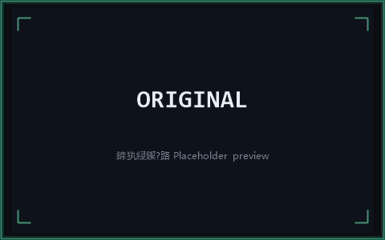
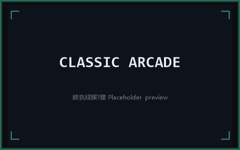
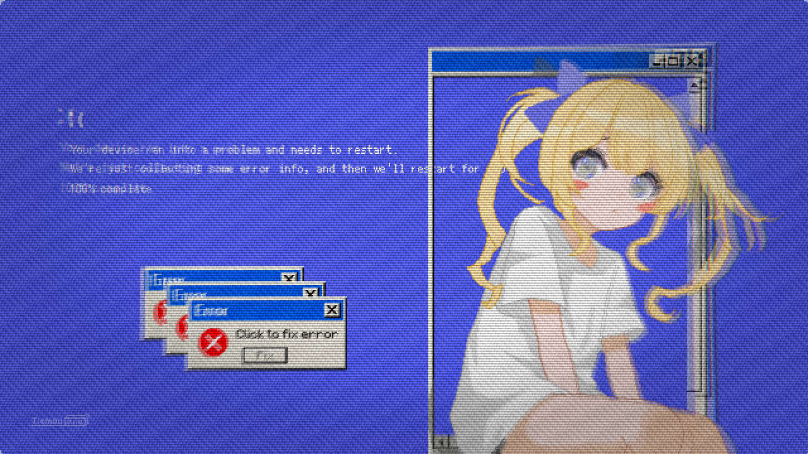
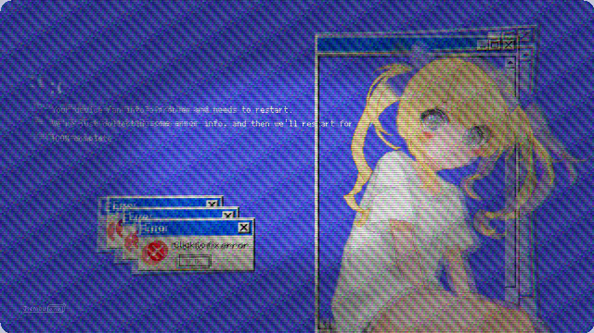
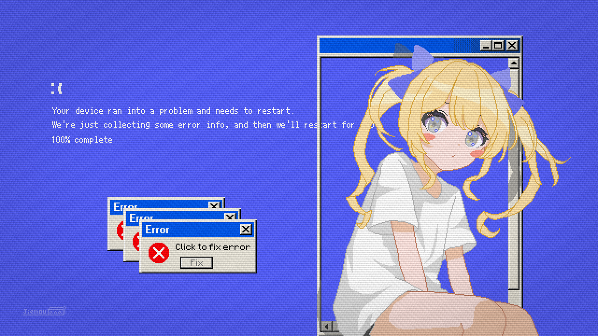
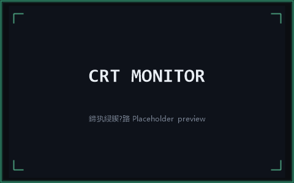
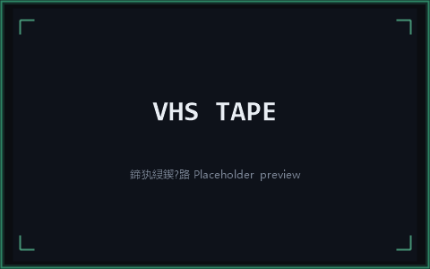
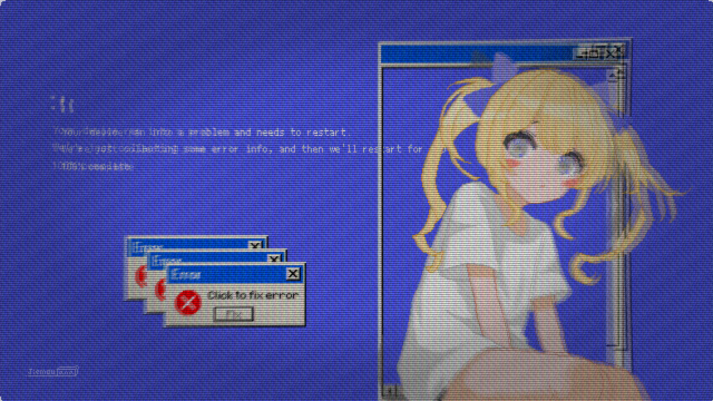
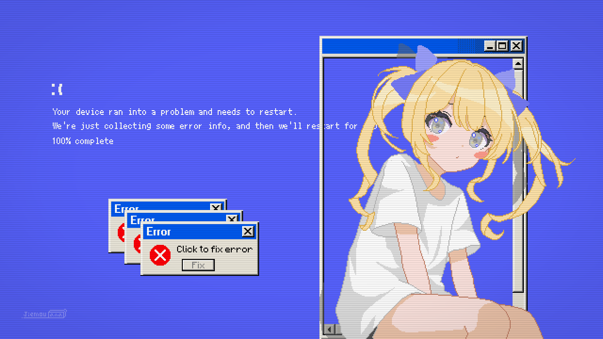
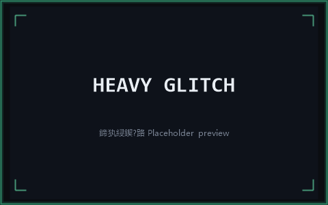

# CRT Retro Filter for Aseprite


> [中文文档](README_CN.md)

Render your pixel art through the lens of a classic CRT display. 12 independent filters, 9 built-in presets, real-time preview, bilingual EN/ZH support, and full custom preset management.

<p align="center">
  <strong>12 Filters · 5 Tabs · 9 Presets · Real-time Preview · Single Undo</strong>
</p>

## Table of Contents

- [Features](#features)
- [Showcase](#showcase)
- [Installation](#installation)
- [Usage](#usage)
- [Filter Reference](#filter-reference)
- [Presets](#presets)
- [Custom Presets](#custom-presets)
- [Filter Chain Order](#filter-chain-order)
- [FAQ](#faq)
- [Requirements](#requirements)
- [File Structure](#file-structure)
- [License](#license)

## Features

- **12 CRT Filters** — Scanlines, Screen Curvature (convex/concave), Chromatic Aberration, Phosphor Bloom, Vignette, Signal Noise, Color Temperature, Pixelation, RGB Phosphor Mask, Horizontal Ripple, Interlacing Jitter, Phosphor Persistence
- **Real-time Preview** — See changes instantly as you adjust parameters, powered by an on-canvas preview with change detection for performance
- **Before/After Compare** — Toggle or hold the preview canvas to switch between the filtered result and the original
- **9 Built-in Presets** — Classic Arcade, 80s Computer, Broadcast TV, Subtle Retro, CRT Monitor, VHS Tape, Trinitron, Pixel Perfect, Heavy Glitch
- **Custom Presets** — Save, load, and delete your own parameter combinations
- **Randomize** — Generate random filter configurations with one click, all controls update visually
- **Duplicate Layer Option** — Optionally apply filters to a new layer, preserving the original
- **Bilingual** — Full English and Chinese (中文) interface, switchable in the dialog
- **Quick Apply** — Re-apply last saved settings without opening the dialog
- **Keyboard Shortcut** — Bind a hotkey to the Randomize command for rapid experimentation

## Showcase

> 📷 **Placeholder note**: The images below are placeholders. To add real screenshots, simply overwrite the files with the same names under `assets/` — no README changes needed.

### Original

<p align="center">
  
</p>

### Preset Gallery

| Classic Arcade | 80s Computer | Broadcast TV |
| --- | --- | --- |
|  |  |  |

| Subtle Retro | CRT Monitor | VHS Tape |
| --- | --- | --- |
|  |  |  |

| Trinitron | Pixel Perfect | Heavy Glitch |
| --- | --- | --- |
|  |  |  |

### Plugin Dialog

<p align="center">
  
</p>

## Installation

1. Download the latest `.aseprite-extension` file from [Releases](https://github.com/JiemouQAQ/crt-retro-filter/releases)
2. Double-click the file, or install via **Edit → Preferences → Extensions → Add Extension** in Aseprite
3. Restart Aseprite or click **Reload Scripts**

> **Manual install**: Copy the entire `crt-retro-filter` folder into `%APPDATA%/Aseprite/extensions/` (Windows) or `~/Library/Application Support/Aseprite/extensions/` (macOS).

## Usage

### Open the Dialog

**Edit → CRT Retro Filter** opens the parameter panel. Menu items are grayed out when no image is open.

### Quick Apply

**Edit → CRT Retro Filter (Quick Apply)** re-applies the last saved settings directly to the active layer.

### Randomize

**Edit → CRT Retro Filter (Randomize)** applies a randomly generated filter configuration. Bind a keyboard shortcut (e.g., `Ctrl+Shift+R`) in **Edit → Keyboard Shortcuts**.

### Dialog Layout

The dialog is organized into five tabs:

| Tab | Contents |
|-----|----------|
| **Presets** | Preset selection, language switch, duplicate layer option, custom preset management, Randomize button |
| **Screen** | Scanlines, Screen Curvature, Chromatic Aberration |
| **Display** | Bloom / Glow, Vignette, Noise / Static |
| **Pixel** | Color Temperature, Pixelation, RGB Phosphor Mask |
| **Signal** | Horizontal Ripple, Interlacing Jitter, Phosphor Persistence |

Each filter has an independent **Enable** toggle. Click **Apply** to commit — all changes are grouped into a single undo step (`Ctrl+Z`).

### Before/After Compare

The preview canvas supports two compare modes:

- **Hold to compare**: press and **hold the left mouse button** on the preview canvas to temporarily show the original; release to return to the filtered result
- **Lock compare**: check **"Compare Original"** below the canvas to keep the original visible until unchecked

While comparing, the preview area is outlined with a green border as a hint.

### Duplicate Layer

Check **"Duplicate Layer Before Apply"** in the Presets tab to apply filters to a new copy of the active layer, keeping the original untouched. The new layer is named `{original name} CRT`.

## Filter Reference

### Scanlines
Simulates the horizontal dark lines created by CRT interlaced scanning. Alternating rows dim slightly as the electron beam scans.

| Parameter | Range | Description |
|-----------|-------|-------------|
| Intensity | 0–100 | Scanline darkness (higher = darker) |
| Thickness | 1–4 | Thickness in pixel rows |

### Screen Curvature
Simulates the spherical curvature of a CRT tube. Supports both convex (positive) and concave (negative) curvature.

| Parameter | Range | Description |
|-----------|-------|-------------|
| Curvature | -100–100 | Bend amount (negative = concave, positive = convex) |
| Corner Radius | 0–100 | Rounded corner radius |

### Chromatic Aberration
Simulates imperfect RGB convergence. Red and blue channels are shifted radially outward from center.

| Parameter | Range | Description |
|-----------|-------|-------------|
| Red Shift | -5–5 | Red channel pixel offset |
| Blue Shift | -5–5 | Blue channel pixel offset |
| Falloff | 0–100 | Shift intensity ramp from center to edge |

### Phosphor Bloom / Glow
Simulates the halo from excited phosphors. Bright pixels above a threshold are blurred and additively blended back.

| Parameter | Range | Description |
|-----------|-------|-------------|
| Threshold | 0–255 | Luminance threshold for bloom contribution |
| Radius | 1–10 | Bloom spread radius |
| Intensity | 0–100 | Bloom strength |

### Vignette
Simulates edge brightness falloff from the electron beam's steeper angle at screen edges.

| Parameter | Range | Description |
|-----------|-------|-------------|
| Intensity | 0–100 | Edge darkening strength |
| Inner Radius | 0–100 | Where vignette begins (% of diagonal) |
| Softness | 0–100 | Gradient smoothness |

### Noise / Static
Simulates analog signal noise and electrostatic interference.

| Parameter | Range | Description |
|-----------|-------|-------------|
| Intensity | 0–100 | Noise strength |
| Grain Size | 1–4 | Grain size in pixels |
| Monochrome | on/off | Luminance-only noise (off = per-channel RGB noise) |
| Fixed Noise | on/off | Use a constant noise pattern (stable when applied per animation frame) |

### Color Temperature
Shifts the color balance toward warm (low Kelvin) or cool (high Kelvin) tones.

| Parameter | Range | Description |
|-----------|-------|-------------|
| Kelvin | 3000–9300 | Color temperature in Kelvin |
| Intensity | 0–100 | Effect strength |

### Pixelation
Reduces resolution by grouping pixels into blocks, simulating low-res displays.

| Parameter | Range | Description |
|-----------|-------|-------------|
| Block Size | 1–8 | Pixel block dimensions |

### RGB Phosphor Mask
Simulates the physical phosphor dot/stripe pattern on a CRT screen.

| Parameter | Range | Description |
|-----------|-------|-------------|
| Intensity | 0–100 | Mask visibility |
| Mask Type | Grille / Shadow / Slot | Phosphor arrangement pattern |
| Element Width | 1–4 | Width of each mask element |

### Horizontal Ripple
Simulates horizontal sync interference causing wavy distortion.

| Parameter | Range | Description |
|-----------|-------|-------------|
| Amplitude | 0–10 | Wave height |
| Frequency | 0–100 | Wave density |
| Phase | 0–360 | Wave offset |
| Falloff | 0–100 | Edge fade |

### Interlacing Jitter
Simulates frame-to-frame misalignment from interlaced scanning.

| Parameter | Range | Description |
|-----------|-------|-------------|
| Intensity | 0–100 | Jitter displacement amount |
| Direction | Horizontal / Vertical | Jitter axis |

### Phosphor Persistence
Simulates the afterglow of CRT phosphors, creating a ghosting effect from previous frames.

| Parameter | Range | Description |
|-----------|-------|-------------|
| Intensity | 0–100 | Afterglow strength |
| Threshold | 0–255 | Minimum brightness for persistence |

## Presets

| Preset | Description |
|--------|-------------|
| **Classic Arcade** | Strong scanlines, noticeable curvature, vignette |
| **80s Computer** | Moderate scanlines, subtle chromatic aberration |
| **Broadcast TV** | Heavy curvature, strong aberration, large bloom |
| **Subtle Retro** | Very light scanlines and vignette only |
| **CRT Monitor** | 90s PC: thin scanlines, light bloom, RGB shadow mask |
| **VHS Tape** | Degraded VHS: jitter, noise, color temperature shift |
| **Trinitron** | Sony aperture grille, deep contrast, sharp |
| **Pixel Perfect** | Minimal CRT: subtle scanlines, no distortion |
| **Heavy Glitch** | All effects maxed for experimental glitch art |

## Custom Presets

1. Adjust parameters to your liking
2. Click **Save Preset** in the Presets tab
3. Enter a name and confirm
4. Your preset appears in the custom preset dropdown
5. Use **Delete Preset** to remove it

Custom presets are persisted via `plugin.preferences` and survive Aseprite restarts.

## Filter Chain Order

```
Pixelation → Curvature → Chromatic Aberration → Ripple → Jitter →
Scanlines → RGB Mask → Bloom → Phosphor Persistence → Vignette →
Color Temperature → Noise
```

This order mirrors the real CRT imaging pipeline: resolution reduction first, then geometry distortion, signal artifacts, phosphor patterns, bloom, screen properties, and finally noise overlay.

## FAQ

### Why am I asked to convert to RGB color mode first?

The per-pixel filter math works on RGB channels; **Indexed** and **Grayscale** modes cannot render correctly. Convert via **Image → Color Mode → RGB** before applying.

### The preview feels laggy. What can I do?

The preview is computed on canvas in real time, so large sprites cost more. Try:

- Working on a smaller canvas or a small test region
- Turning off the **Enable** toggle for filters you don't need
- Lowering the intensity of expensive filters such as Noise or Bloom
- Closing the dialog after tweaking and applying the final result

### How do I undo after applying?

All changes are grouped into a **single** undo step when you click **Apply** — press `Ctrl+Z` (`Cmd+Z` on macOS) to revert everything at once.

### How do I bind a shortcut to Randomize?

Open **Edit → Keyboard Shortcuts**, search for **CRT Retro Filter**, and assign a shortcut to the **Randomize** command (e.g., `Ctrl+Shift+R`). All script command shortcuts live in **Edit → Keyboard Shortcuts**.

### Where are my custom presets stored?

Custom presets are persisted via `plugin.preferences` in Aseprite's user config directory and survive restarts. Uninstalling the extension does not remove them.

### Which Aseprite version is required?

**Aseprite v1.3.0 or later** (v1.3.11+ recommended). Older versions may lack required APIs.

### Is this a physically accurate CRT simulation?

No — it is an **artistic** CRT simulation tuned for a good-looking retro look, not a per-phosphor physics model. Parameters are tuned so you can get a nice picture quickly.

### Found a bug or have an idea?

Open an issue at [GitHub Issues](https://github.com/JiemouQAQ/crt-retro-filter/issues) with your Aseprite version, OS, and reproduction steps.

## Requirements

- **Aseprite v1.3.0** or later (v1.3.11+ recommended)
- **RGB color mode** recommended
- **INDEXED** and **GRAYSCALE** modes are not supported — the plugin will alert you to convert to RGB first

## File Structure

```
crt-retro-filter/
├── package.json              # Extension manifest
├── main.lua                  # Entry point: command & menu registration
├── filters/
│   ├── scanlines.lua         # Scanlines
│   ├── curvature.lua         # Screen curvature (convex/concave)
│   ├── aberration.lua        # Chromatic aberration
│   ├── bloom.lua             # Phosphor bloom / glow
│   ├── vignette.lua          # Vignette
│   ├── noise.lua             # Signal noise
│   ├── color_temperature.lua # Color temperature
│   ├── pixelation.lua        # Pixelation
│   ├── rgb_mask.lua          # RGB phosphor mask (grille/shadow/slot)
│   ├── horizontal_ripple.lua # Horizontal ripple
│   ├── interlacing_jitter.lua# Interlacing jitter
│   └── phosphor_persistence.lua # Phosphor persistence
├── ui/
│   └── dialog.lua            # Dialog UI, preview, presets, randomize
└── utils/
    ├── color.lua             # Color utilities
    ├── lang.lua              # Bilingual EN/ZH strings
    └── math.lua              # Gaussian kernel, interpolation, fast hash
```

> The `assets/` folder at the repository root only holds README showcase images (including placeholders); it is not part of the extension itself.

## License

MIT
