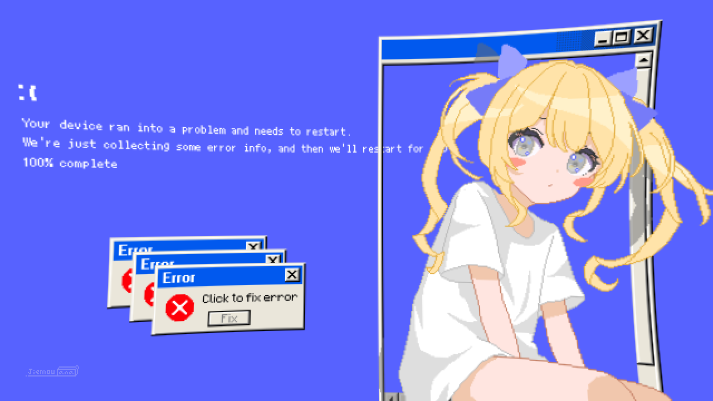
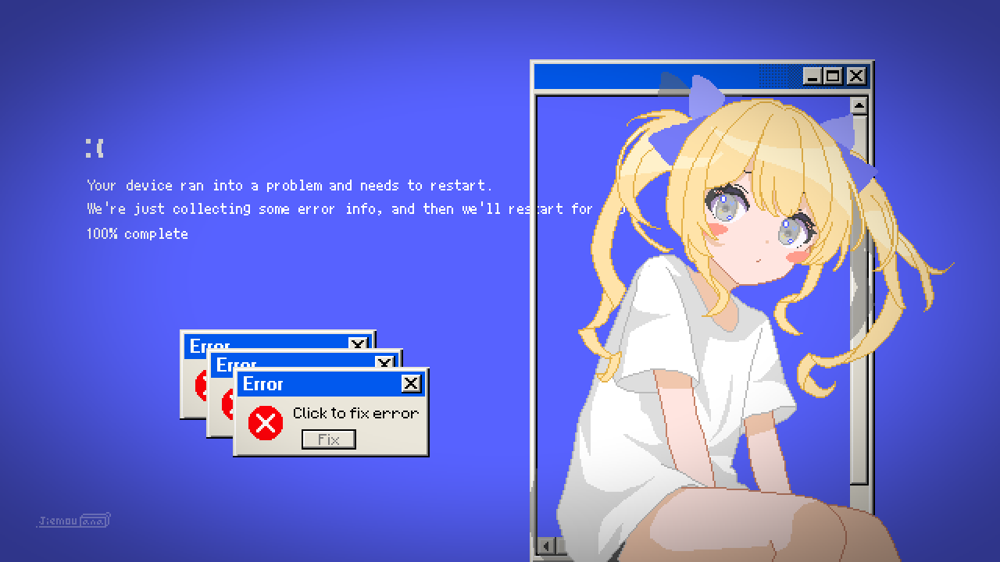
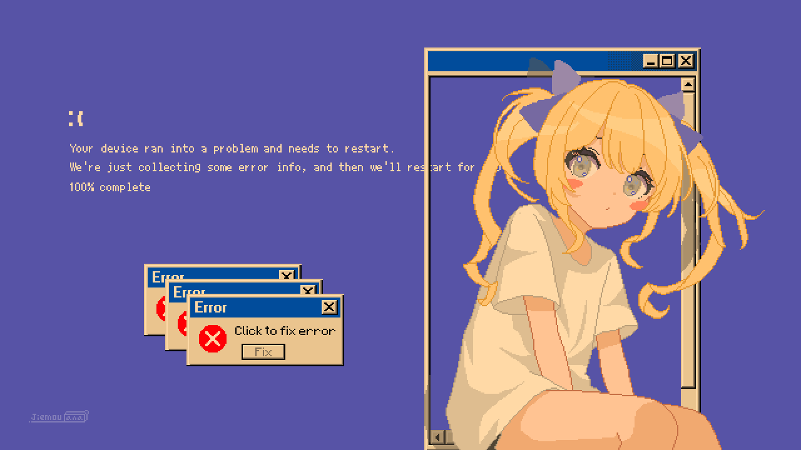
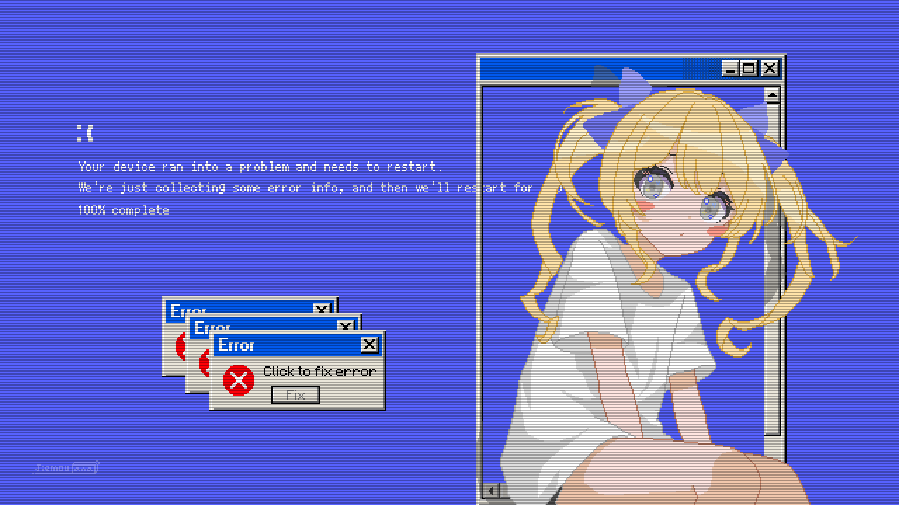
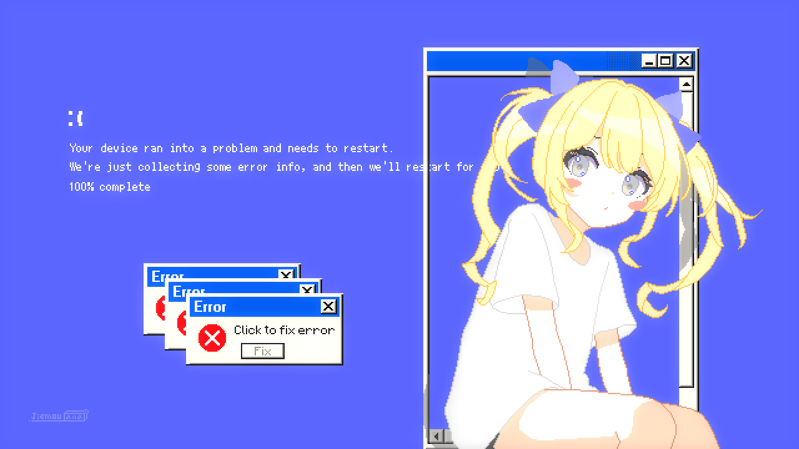
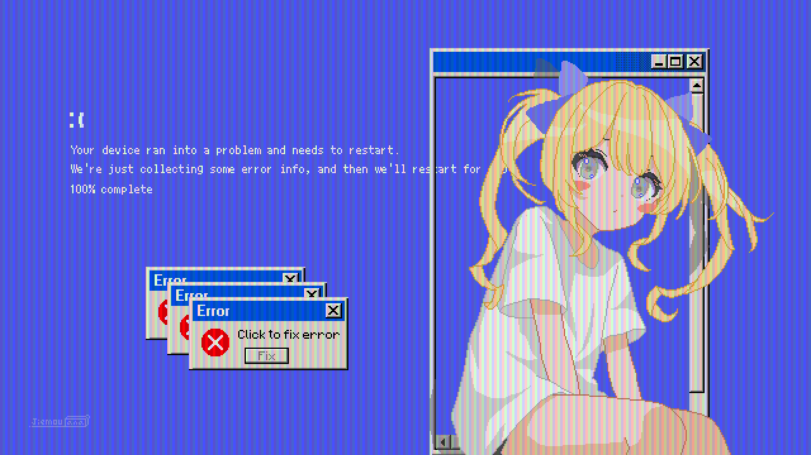
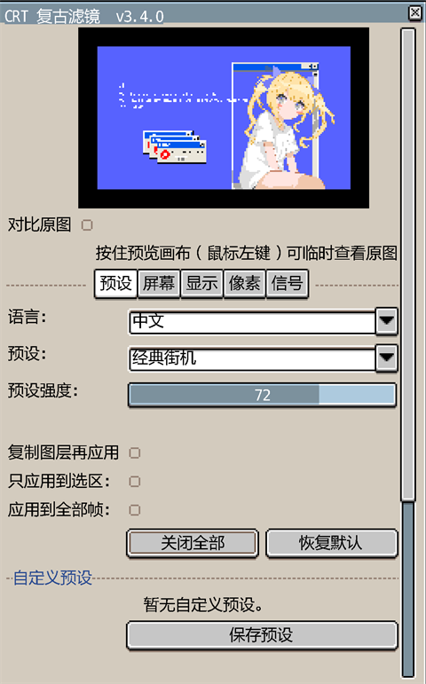

# CRT 复古滤镜 for Aseprite


> [English Documentation](README.md)

将你的像素画作品渲染为经典 CRT 显示器风格。18 个独立滤镜、10 套内置预设、实时预览、中英文双语界面、自定义预设管理。

<p align="center">
  <strong>18 个滤镜 · 7 个标签页 · 10 套预设 · 实时预览 · 一键撤销</strong>
</p>

## 目录

- [功能特性](#功能特性)
- [效果展示](#效果展示)
- [安装](#安装)
- [使用说明](#使用说明)
- [滤镜参数说明](#滤镜参数说明)
- [预设一览](#预设一览)
- [自定义预设](#自定义预设)
- [滤镜链顺序](#滤镜链顺序)
- [FAQ 常见问题](#faq-常见问题)
- [系统要求](#系统要求)
- [文件结构](#文件结构)
- [许可证](#许可证)

## 功能特性

- **18 个 CRT 滤镜** — 扫描线、屏幕弧度（内凹/外凸）、色差、辉光、暗角、噪点、色温、像素化、RGB 荧光粉遮罩、水平波纹、隔行扫描抖动、荧光粉余晖，以及故障艺术：行撕裂、数据损坏、像素排序、VHS 跟踪条、置换扭曲、镜像撕裂
- **故障艺术** — 两个标签页共 6 个确定性滤镜（数据故障：行撕裂/数据损坏/像素排序；信号故障：VHS 跟踪条/置换扭曲/镜像撕裂），相同参数结果完全一致，配合"全部帧应用"让动画每帧故障不闪烁
- **实时预览** — 调整参数时即时看到效果变化，基于 Canvas 预览并带变更检测以优化性能
- **前后对比** — 勾选或按住预览画布，随时在滤镜效果与原图之间切换对比
- **10 套内置预设** — 经典街机、80 年代电脑、老式电视、轻复古、CRT 显示器、VHS 录像带、特丽珑、像素完美、重度故障、数字故障
- **预设强度** — 一条滑块整体调节所有滤镜的效果浓度（0–100%），切换内置预设时保留你的设置
- **自定义预设** — 保存、加载、删除你自己的参数组合
- **随机生成** — 一键随机生成滤镜配置，所有控件数值同步更新
- **复制图层选项** — 可选择在副本图层上应用滤镜，保留原始图层
- **选区支持** — 只对选区内的像素应用滤镜，选区外保持原样
- **全部帧应用** — 一键把滤镜应用到整段动画的所有帧，合并为一次撤销操作
- **逐帧演变** — 勾选后进入"活"的动画模式（确定性生成，重跑动画逐帧一致）：噪点变胶片颗粒、6 个故障滤镜每帧换图案、VHS 跟踪条滚动、波纹相位扫动、色温漂移、色差/辉光/暗角/抖动呼吸脉动、像素化分辨率闪烁、RGB 遮罩滚动，且**荧光粉余晖使用上一帧真实画面**产生真残影
- **任务保护** — 任务过重时主动终止并提示，处理失败自动回滚，绝不卡死或崩溃；对话框已注明大任务需耐心等待
- **中英双语** — 完整的中英文界面，可在对话框中随时切换
- **快速应用** — 无需打开对话框，直接用上次保存的参数应用滤镜
- **快捷键绑定** — 可为"快速应用"和"随机生成"绑定自定义快捷键，快速实验不同效果

## 效果展示

> 📷 以下均为真实效果截图：原图为 1280×720 像素画作品，依次应用各预设与单个滤镜所得。

### 原图

<p align="center">
  
</p>

### 九套预设效果

**经典街机** — 强力扫描线、明显弧度、暗角

<p align="center">
  
</p>

**80 年代电脑** — 中等扫描线、轻微色差

<p align="center">
  
</p>

**老式电视** — 强弧度、重色差、大光晕

<p align="center">
  
</p>

**轻复古** — 仅轻微扫描线和暗角

<p align="center">
  
</p>

**CRT 显示器** — 90年代PC：细扫描线、轻微辉光、RGB点阵遮罩

<p align="center">
  
</p>

**VHS 录像带** — 录像带劣化：抖动、噪点、色温偏移

<p align="center">
  
</p>

**特丽珑** — 索尼栅格遮罩、高对比、锐利画面

<p align="center">
  
</p>

**像素完美** — 极简CRT：微妙扫描线、无畸变

<p align="center">
  
</p>

**重度故障** — 实验风格：所有效果全开、故障艺术

<p align="center">
  
</p>

**数字故障** — 经典故障艺术：像素排序、行撕裂、数据损坏

<p align="center">


### 单滤镜效果

（按对话框标签页顺序：屏幕 → 显示 → 像素 → 信号 → 数据故障 → 信号故障）

**扫描线**（屏幕）

<p align="center">
  
</p>

**屏幕弧度**（屏幕）

<p align="center">
  
</p>

**色差**（屏幕）

<p align="center">
  
</p>

**辉光**（显示）

<p align="center">
  
</p>

**暗角**（显示）

<p align="center">
  
</p>

**噪点**（显示）

<p align="center">
  
</p>

**色温**（像素）

<p align="center">
  
</p>

**像素化**（像素）

<p align="center">
  
</p>

**RGB 荧光粉遮罩**（像素）

<p align="center">
  
</p>

**水平波纹**（信号）

<p align="center">
  
</p>

**隔行扫描抖动**（信号）

<p align="center">
  
</p>

**荧光粉余晖**（信号）

<p align="center">
  
</p>

**行撕裂**（数据故障）

<p align="center">

</p>

**数据损坏**（数据故障）

<p align="center">
 
</p>

**像素排序**（数据故障）

<p align="center">

</p>

**VHS 跟踪条**（信号故障）

<p align="center">

</p>

**置换扭曲**（信号故障）

<p align="center">

</p>

**镜像撕裂**（信号故障）

<p align="center">

</p>

### 插件界面

<p align="center">
  
</p>

## 安装

1. 从 [Releases](https://github.com/JiemouQAQ/crt-retro-filter/releases) 下载最新的 `.aseprite-extension` 文件
2. 双击文件安装，或通过 **编辑 → 首选项 → 扩展 → 添加扩展** 手动安装
3. 重启 Aseprite 或点击 **重新加载脚本**

> **手动安装**：将整个 `crt-retro-filter` 文件夹复制到 `%APPDATA%/Aseprite/extensions/`（Windows）或 `~/Library/Application Support/Aseprite/extensions/`（macOS）。

## 使用说明

### 打开对话框

**编辑 → CRT Retro Filter → 打开对话框** 打开参数面板。没有打开图片时菜单项自动灰色不可用。

### 快速应用

**编辑 → CRT Retro Filter → 快速应用** 用上次保存的参数直接应用到当前图层。

### 随机生成

**编辑 → CRT Retro Filter → 随机生成** 随机生成滤镜参数并应用。

> 插件不预设任何快捷键，但所有命令（打开对话框 / 快速应用 / 随机生成）都可以在 **编辑 → 键盘快捷键** 中搜索 **CRT Retro Filter** 自行绑定，例如随机生成 `Ctrl+Shift+R`、快速应用 `Ctrl+Shift+Q`。

### 对话框布局

对话框分为七个标签页：

| 标签页 | 内容 |
|--------|------|
| **预设** | 预设选择、预设强度、语言切换、复制图层选项、只应用到选区、应用到全部帧、逐帧演变、自定义预设管理、随机生成按钮 |
| **屏幕** | 扫描线、屏幕弧度、色差 |
| **显示** | 辉光、暗角、噪点 |
| **像素** | 色温、像素化、RGB 荧光粉遮罩 |
| **信号** | 水平波纹、隔行扫描抖动、荧光粉余晖 |
| **数据故障** | 行撕裂、数据损坏、像素排序 |
| **信号故障** | VHS 跟踪条、置换扭曲、镜像撕裂 |

每个滤镜都有独立的 **启用** 开关。点击 **应用** 提交，所有修改合并为一个撤销步骤（`Ctrl+Z`）。

### 预设强度

预设下拉框下方的 **"预设强度"** 滑块可以整体调节所有滤镜的效果浓度：

- **100%** — 完整效果（默认）
- **50%** — 效果与原始画面各半
- **0%** — 完全等于原图

切换内置预设时滑块保持你的设置不变；保存自定义预设时会连同强度一起保存。

### 前后对比

预览画布支持两种对比方式：

- **按住对比**：在预览画布上**按住鼠标左键**，画面会临时切换为原图，松开后恢复滤镜效果
- **锁定对比**：勾选画布下方的 **"对比原图"**，画面锁定显示原图，取消勾选后恢复

对比模式下预览区域会显示一圈绿色描边作为提示。

### 复制图层

在预设标签页勾选 **"复制图层再应用"**，滤镜将应用到当前图层的副本上，原图层保持不变。新图层命名为 `{原图层名} CRT`。

### 选区应用

在预设标签页勾选 **"只应用到选区"**，滤镜只作用于当前选区内的像素，选区外的像素保持原样，预览画面也会同步显示选区效果。

如果勾选时没有活动的选区，点击 **应用** 时会弹出提示。

### 全部帧应用

勾选 **"应用到全部帧"** 后，滤镜会应用到当前图层的**所有帧**（适用于动画），整段动画合并为**一次**撤销操作。

**做动画**：同时勾选 **"逐帧演变"**，进入完整的"活 CRT"动画模式（全部确定性，同参数重跑动画逐帧一致）：

- **图案演变**：噪点变胶片颗粒；行撕裂/数据损坏/像素排序/置换扭曲/镜像撕裂每帧换一套图案；VHS 跟踪条逐帧滚动
- **参数动画**：波纹相位扫动、色温冷暖漂移、色差通道脉动、弧度/辉光/暗角/抖动呼吸、像素化分辨率闪烁、RGB 遮罩滚动
- **真残影**：荧光粉余晖使用**上一帧的实际输出**按强度衰减混合，产生真正的动态拖影
- 扫描线的 **"隔行闪烁"** 可单独开启；对话框预览直接显示**当前帧**的效果

> 提示：如果希望某几个滤镜保持固定图案、只有其他滤镜演变，把那些滤镜关掉或使用"固定噪点"即可。

**大任务保护**：应用前插件会估算工作量——预计耗时很长的任务会弹出提示并**主动终止**（建议缩小画布、减少帧数或滤镜数量）；大任务**没有进度条，请耐心等待**（对话框预设区已注明）；任何处理失败都会自动回滚并显示错误信息，不会让 Aseprite 崩溃。

## 滤镜参数说明

### 扫描线
模拟 CRT 隔行扫描产生的水平暗线。电子束逐行扫描时，奇偶行交替刷新，等待刷新的行会略微变暗。

| 参数 | 范围 | 说明 |
|------|------|------|
| 强度 | 0–100 | 扫描线暗度（越高越暗） |
| 粗细 | 1–4 | 扫描线像素行数 |
| 隔行闪烁 | 开/关 | 逐帧交替暗行位置，产生 CRT 隔行闪动（需配合逐帧演变或动画） |

### 屏幕弧度
模拟 CRT 显像管的球形物理弯曲。支持**桶形（正值，外凸）**和**枕形（负值，内凹）**两种模式，双线性插值平滑过渡；越界采样自动边缘钳制，变形结果**完全覆盖原图**（无半透明透出、无透明空洞），画布尺寸保持不变。

| 参数 | 范围 | 说明 |
|------|------|------|
| 弧度 | -100–100 | 弯曲程度（负值内凹，正值外凸） |
| 圆角 | 0–100 | 屏幕圆角半径（像素，上限为画面短边的 50%） |

### 色差
模拟 CRT 三束电子枪的不完美汇聚。RGB 三束在屏幕边缘无法精确击中同一荧光粉点，导致红蓝通道边缘偏移。

| 参数 | 范围 | 说明 |
|------|------|------|
| 红通道偏移 | -5–5 | 红色通道像素偏移量 |
| 蓝通道偏移 | -5–5 | 蓝色通道像素偏移量 |
| 衰减 | 0–100 | 偏移从中心到边缘的强度变化 |

### 辉光
模拟 CRT 荧光粉被电子束激发时产生的光晕。亮度超过阈值的像素经过高斯模糊后叠加回原图。

| 参数 | 范围 | 说明 |
|------|------|------|
| 阈值 | 0–255 | 产生辉光的亮度阈值 |
| 半径 | 1–10 | 辉光扩散半径 |
| 强度 | 0–100 | 辉光强度 |

### 暗角
模拟 CRT 屏幕边缘的自然亮度衰减。电子束在屏幕边缘以更陡的角度击中荧光粉，激发效率降低。

| 参数 | 范围 | 说明 |
|------|------|------|
| 强度 | 0–100 | 边缘暗化强度 |
| 内径 | 0–100 | 暗角起始位置（对角线百分比） |
| 柔和度 | 0–100 | 渐变平滑度 |

### 噪点
模拟模拟信号传输中的随机噪声和 CRT 电子枪的散粒噪声。

| 参数 | 范围 | 说明 |
|------|------|------|
| 强度 | 0–100 | 噪点强度 |
| 颗粒 | 1–4 | 噪点颗粒大小 |
| 单色 | 开/关 | 仅亮度噪点（关闭则 RGB 通道独立噪点） |
| 固定噪点 | 开/关 | 使用固定随机图案，逐帧应用时噪点保持一致 |
| 逐帧演变 | 开/关 | 勾选"逐帧演变"后，噪点图案随帧号确定性变化，形成胶片颗粒动画 |

### 色温
将色彩平衡向暖色（低色温）或冷色（高色温）偏移。

| 参数 | 范围 | 说明 |
|------|------|------|
| 色温 | 3000–9300 | 开尔文色温值 |
| 强度 | 0–100 | 效果强度 |

### 像素化
将像素分组为块来降低分辨率，模拟低分辨率显示效果。

| 参数 | 范围 | 说明 |
|------|------|------|
| 块大小 | 1–8 | 像素块尺寸 |

### RGB 荧光粉遮罩
模拟 CRT 屏幕上的物理荧光粉点/条纹排列图案。

| 参数 | 范围 | 说明 |
|------|------|------|
| 强度 | 0–100 | 遮罩可见度 |
| 遮罩类型 | 栅格 / 点阵 / 槽状 | 荧光粉排列方式 |
| 元素宽度 | 1–4 | 每个遮罩元素的宽度 |

### 水平波纹
模拟水平同步信号干扰导致的波浪形画面扭曲。

| 参数 | 范围 | 说明 |
|------|------|------|
| 振幅 | 0–10 | 波纹高度 |
| 频率 | 0–100 | 波纹密度 |
| 相位 | 0–360 | 波纹偏移 |
| 衰减 | 0–100 | 边缘淡化 |

### 隔行扫描抖动
模拟隔行扫描导致的帧间像素错位。

| 参数 | 范围 | 说明 |
|------|------|------|
| 强度 | 0–100 | 抖动偏移量 |
| 方向 | 水平 / 垂直 | 抖动方向 |

### 荧光粉余晖
模拟 CRT 荧光粉的余晖效应，产生类似前一帧的残影。

| 参数 | 范围 | 说明 |
|------|------|------|
| 强度 | 0–100 | 余晖强度 |
| 阈值 | 0–255 | 产生余晖的最低亮度 |

### 行撕裂
模拟数据传输损坏导致的横向切片错位：随机行带被左右平移，是经典的故障撕裂效果。所有随机偏移基于固定哈希，确定性生成。

| 参数 | 范围 | 说明 |
|------|------|------|
| 强度 | 0–100 | 最大水平位移量 |
| 密度 | 0–100 | 受影响行带的比例 |
| 粗细 | 1–8 | 每条切片的行数 |

### 数据损坏
模拟压缩/传输错误：矩形色块被水平推移，露出错位边缘。

| 参数 | 范围 | 说明 |
|------|------|------|
| 密度 | 0–100 | 受影响色块的比例 |
| 块大小 | 1–8 | 色块尺寸 |
| 位移 | 0–100 | 最大水平位移量 |

### 像素排序
最经典的故障艺术手法：对超过亮度阈值的连续像素段按亮度重新排序，产生渐变涂抹效果。

| 参数 | 范围 | 说明 |
|------|------|------|
| 强度 | 0–100 | 参与处理的扫描线比例 |
| 阈值 | 0–100 | 只排序超过该亮度的像素段 |
| 方向 | 水平 / 垂直 | 排序方向 |

### VHS 跟踪条
模拟录像带走带错误：一条横向干扰带内，行像素被噪波位移并叠加静电噪点。

| 参数 | 范围 | 说明 |
|------|------|------|
| 强度 | 0–100 | 位移与噪点强度 |
| 条宽 | 1–16 | 干扰带半高（像素行） |
| 位置 | 0–100 | 干扰带中心位置（从上往下） |

### 置换扭曲
随机向量场扭曲：图像按块状噪声场位移，产生类似 AE 置换贴图的波形错乱。支持水平、垂直或双向。

| 参数 | 范围 | 说明 |
|------|------|------|
| 强度 | 0–100 | 最大偏移量 |
| 缩放 | 0–100 | 噪声场单元大小（低=细碎，高=粗犷） |
| 方向 | 水平 / 垂直 / 双向 | 位移方向 |

### 镜像撕裂
模拟视频缓冲损坏：选中的横向/纵向条带被镜像翻转（左右或上下反射），形成镜面对称的错位。

| 参数 | 范围 | 说明 |
|------|------|------|
| 强度 | 0–100 | 条带厚度（像素） |
| 密度 | 0–100 | 受影响条带的比例 |
| 方向 | 水平 / 垂直 | 镜像轴（水平=左右翻转，垂直=上下翻转） |

## 预设一览

| 预设 | 说明 |
|------|------|
| **经典街机** | 强力扫描线、明显弧度、暗角 |
| **80 年代电脑** | 中等扫描线、轻微色差 |
| **老式电视** | 强弧度、重色差、大光晕 |
| **轻复古** | 仅轻微扫描线和暗角 |
| **CRT 显示器** | 90年代PC：细扫描线、轻微辉光、RGB点阵遮罩 |
| **VHS 录像带** | 录像带劣化：抖动、噪点、色温偏移 |
| **特丽珑** | 索尼栅格遮罩、高对比、锐利画面 |
| **像素完美** | 极简CRT：微妙扫描线、无畸变 |
| **重度故障** | 实验风格：所有效果全开、故障艺术 |
| **数字故障** | 经典故障艺术：像素排序、行撕裂、数据损坏 |

## 自定义预设

1. 调整参数到你满意的效果
2. 在预设标签页点击 **保存预设**
3. 输入名称并确认
4. 你的预设会出现在自定义预设下拉列表中
5. 使用 **删除预设** 移除不需要的预设

自定义预设通过 `plugin.preferences` 持久化，重启 Aseprite 后仍然保留。

## 滤镜链顺序

```
像素化 → 屏幕弧度 → 色差 → 水平波纹 → 抖动 →
扫描线 → RGB遮罩 → 辉光 → 荧光粉余晖 → 暗角 →
色温 → 噪点 → 行撕裂 → 数据损坏 → 像素排序 → VHS跟踪条 → 置换扭曲 → 镜像撕裂
```

此顺序模拟真实 CRT 成像管线：先降低分辨率，再进行几何变形，叠加信号伪影，绘制荧光粉图案，添加辉光，最后叠加屏幕物理属性、噪声与故障损坏。

## FAQ 常见问题

### 为什么提示要先转换为 RGB 颜色模式？

滤镜的逐像素运算基于 RGB 通道，**索引色（Indexed）**和**灰度（Grayscale）**模式无法正确渲染。请通过 **图像 → 颜色模式 → RGB** 转换后再使用。

### 预览时画面卡顿怎么办？

预览基于画布实时运算，大尺寸画布下性能消耗较大。可以尝试：

- 在较小的画布或测试区域上调整参数
- 关闭不需要的滤镜的 **启用** 开关
- 降低噪点、辉光等较耗时滤镜的强度
- 调整完成后关闭对话框，再应用最终效果

### 应用后如何撤销？

点击 **应用** 后，所有修改会合并为**一个**撤销步骤，直接按 `Ctrl+Z`（macOS 为 `Cmd+Z`）即可整体回退。

### 如何给“快速应用 / 随机生成”绑定快捷键？

在 **编辑 → 键盘快捷键** 中搜索 **CRT Retro Filter**，为 **Open Dialog / Quick Apply / Randomize** 命令分别绑定快捷键（例如随机生成 `Ctrl+Shift+R`、快速应用 `Ctrl+Shift+Q`）。插件不预设默认快捷键，所有脚本命令的快捷键都在 **编辑 → 键盘快捷键** 中管理，绑定后与菜单布局无关、永久生效。

### 自定义预设保存在哪里？

自定义预设通过 `plugin.preferences` 持久化，存放在 Aseprite 的用户配置目录中，重启后依然保留，卸载扩展也不会丢失。

### 插件支持哪个版本的 Aseprite？

需要 **Aseprite v1.3.0 或更高版本**（推荐 v1.3.11+），低版本可能缺少部分 API。

### 这是物理精确的 CRT 模拟吗？

不是。本插件追求复古**观感**而非物理精确，是艺术化的 CRT 模拟。每个滤镜的参数都经过调整，方便你快速获得好看的画面，而不是复现某台特定显示器。

### 遇到问题或想提建议？

欢迎在 [GitHub Issues](https://github.com/JiemouQAQ/crt-retro-filter/issues) 反馈，附上 Aseprite 版本、操作系统和复现步骤即可。

## 系统要求

- **Aseprite v1.3.0** 或更高版本（推荐 v1.3.11+）
- 推荐 **RGB 颜色模式**
- **索引色** 和 **灰度** 模式不支持 — 插件会提示先转换为 RGB 模式

## 文件结构

```
crt-retro-filter/
├── package.json              # 扩展清单
├── main.lua                  # 入口：命令和菜单注册
├── filters/
│   ├── scanlines.lua         # 扫描线
│   ├── curvature.lua         # 屏幕弧度（内凹/外凸）
│   ├── aberration.lua        # 色差
│   ├── bloom.lua             # 辉光
│   ├── vignette.lua          # 暗角
│   ├── noise.lua             # 噪点
│   ├── color_temperature.lua # 色温
│   ├── pixelation.lua        # 像素化
│   ├── rgb_mask.lua          # RGB荧光粉遮罩（栅格/点阵/槽状）
│   ├── horizontal_ripple.lua # 水平波纹
│   ├── interlacing_jitter.lua# 隔行扫描抖动
│   └── phosphor_persistence.lua # 荧光粉余晖
│   ├── slice_shift.lua         # 行撕裂
│   ├── block_corruption.lua    # 数据损坏
│   ├── pixel_sorting.lua       # 像素排序
│   ├── tracking_band.lua       # VHS跟踪条
│   ├── displacement.lua        # 置换扭曲
│   └── mirror_tear.lua         # 镜像撕裂
├── ui/
│   └── dialog.lua            # 对话框UI、预览、预设、随机生成
└── utils/
    ├── color.lua             # 颜色工具
    ├── lang.lua              # 中英双语字符串
    └── math.lua              # 高斯核、插值、快速哈希
```

> 仓库根目录的 `assets/` 文件夹仅存放 README 展示图片（含占位图），不属于扩展包本身。

## 许可证

MIT
